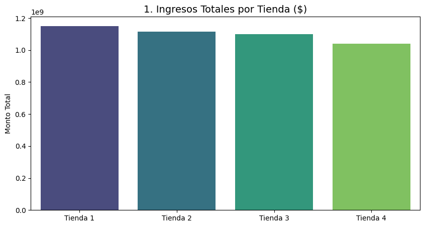
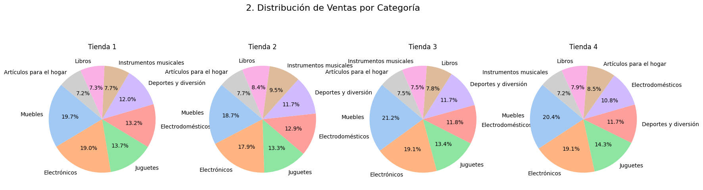
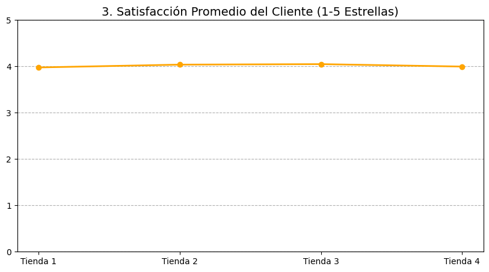
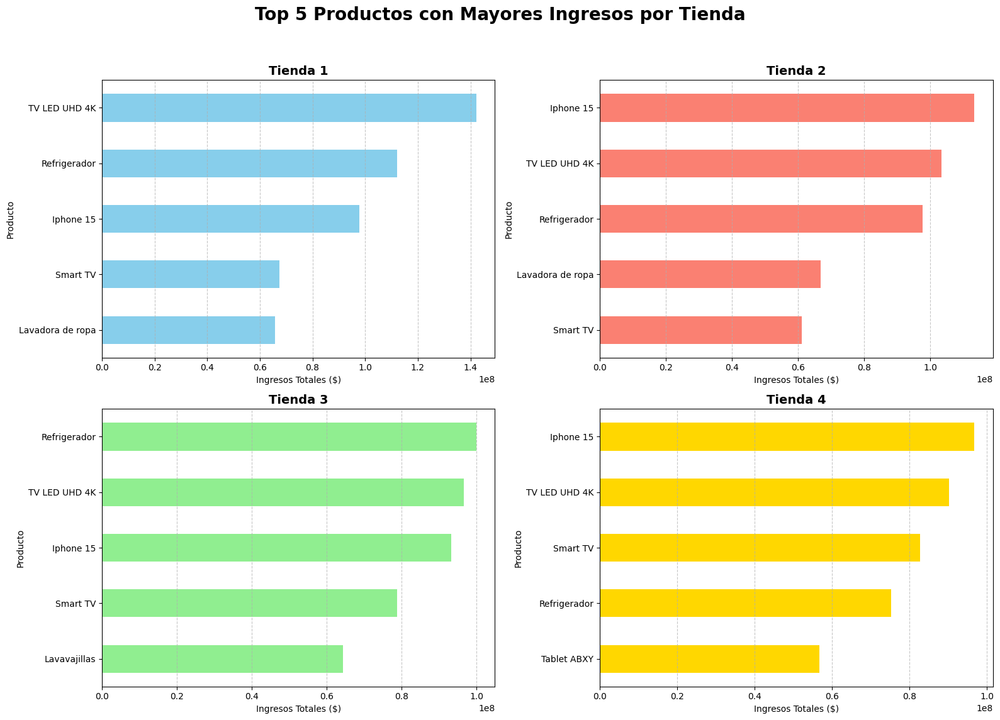
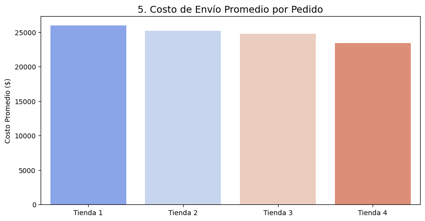

# challenge-Data-Sciencie-Alura-Store
Autor: Victor Asencio
# Análisis de Desempeño y Optimización de Alura Store 🛒📊

## 📝 Resumen del Proyecto
Este proyecto consiste en un análisis exhaustivo de datos de cuatro tiendas de retail para evaluar su viabilidad financiera y operativa. A través del procesamiento de grandes volúmenes de datos, se identificaron patrones de ventas, niveles de satisfacción del cliente y eficiencias logísticas con el fin de asesorar en la toma de decisiones sobre la continuidad o venta de activos.

## 🎯 El Objetivo
El propósito principal es actuar como un **analista de datos** para el Sr. Juan, identificando cuál de sus cuatro tiendas presenta el menor desempeño y recomendando una estrategia de desinversión para optimizar su capital.


## 🚀 Objetivos del Challenge
* **Limpiar y normalizar** bases de datos provenientes de distintas fuentes CSV.
* **Analizar la facturación bruta** y el comportamiento de las categorías de productos.
* **Evaluar la experiencia del usuario** mediante métricas de calificación y satisfacción.
* **Identificar ineficiencias logísticas** comparando costos de envío vs. precios de venta.
* **Generar visualizaciones de datos** que respalden una recomendación comercial de alto impacto.

---

## 📂 Fuentes de Datos
Los datos fueron obtenidos de los repositorios públicos de Alura Latam:

* **Tienda 1:** [Descargar tienda_1.csv](https://raw.githubusercontent.com/alura-es-cursos/challenge1-data-science-latam/refs/heads/main/base-de-datos-challenge1-latam/tienda_1%20.csv)
* **Tienda 2:** [Descargar tienda_2.csv](https://raw.githubusercontent.com/alura-es-cursos/challenge1-data-science-latam/refs/heads/main/base-de-datos-challenge1-latam/tienda_2.csv)
* **Tienda 3:** [Descargar tienda_3.csv](https://raw.githubusercontent.com/alura-es-cursos/challenge1-data-science-latam/refs/heads/main/base-de-datos-challenge1-latam/tienda_3.csv)
* **Tienda 4:** [Descargar tienda_4.csv](https://raw.githubusercontent.com/alura-es-cursos/challenge1-data-science-latam/refs/heads/main/base-de-datos-challenge1-latam/tienda_4.csv)

---

## 📋 Estructura del Dataset

| Columna | Descripción |
| :--- | :--- |
| **Producto** | Nombre del producto vendido. |
| **Categoría del Producto** | Clasificación del producto. |
| **Precio** | Valor de venta del producto. |
| **Costo de envío** | Costo asociado a la entrega del producto. |
| **Fecha de Compra** | Fecha en que se realizó la transacción. |
| **Vendedor** | Vendedor responsable de la venta. |
| **Lugar de Compra** | Ciudad de la transacción. |
| **Calificación** | Puntuación del cliente (1 a 5). |
| **Método de pago** | Método utilizado para la compra. |
| **Cantidad de cuotas** | Número de pagos parciales. |
| **lat, lon** | Coordenadas geográficas del lugar de compra. |


## 🛠️ Metodología y Análisis
El análisis se dividió en cinco dimensiones críticas:

1.  **Análisis de Facturación (Ingresos Totales):** Cálculo de ingresos brutos por tienda para determinar el liderazgo de mercado.
2.  **Categorías de Productos (Distribución de Ventas):** Identificación del mix de productos para entender la especialización de cada tienda.
3.  **Calificaciones Promedio (Satisfacción):** Auditoría de la reputación de marca y calidad del servicio.
4.  **Productos Estrella vs. Menos Vendidos:** Análisis orientado a identificar los motores de ingresos.
5.  **Costo de Envío Promedio:** Evaluación de la competitividad logística y barreras de compra.

---

## 📈 Visualizaciones y Hallazgos Clave

### 💰 1. Análisis de Facturación (Ingresos Totales)

Este análisis mediante un **gráfico de barras** permite comparar el flujo de caja total recaudado por cada sucursal. Es la métrica fundamental para identificar la rentabilidad financiera y determinar qué unidades de negocio están alcanzando sus objetivos de ventas y cuáles representan un riesgo operativo.



> **Nota Estratégica:** Los ingresos totales son el primer indicador de viabilidad. Una barra significativamente baja en comparación con el promedio del grupo es una señal de alerta inmediata para la gestión de activos.

### 🍕 2. Categorías de Productos (Distribución de Ventas)

Mediante el uso de **gráficos de pastel (Pie Charts)**, analizamos el "Mix de Productos" de cada sucursal. Este análisis revela la diversificación de ingresos: permite identificar si una tienda depende críticamente de una sola categoría o si posee una cartera de ventas equilibrada que mitigue riesgos de mercado.



> **Hallazgo del Mix:** Una alta concentración en categorías de baja rotación en la **Tienda 4** confirma la falta de especialización competitiva frente a las otras unidades de negocio.

### ⭐ 3. Calificaciones Promedio (Satisfacción del Cliente)

El uso de un **gráfico de líneas (o puntos de dispersión)** nos permite auditar el nivel de fidelización y felicidad del consumidor. Una tendencia a la baja en esta métrica es una señal de alerta temprana que indica problemas graves en la calidad del producto, demoras en la logística o deficiencias en el servicio post-venta.



> **Interpretación Crítica:** Mientras que la **Tienda 1** mantiene una línea de satisfacción alta y constante, la **Tienda 4** muestra una volatilidad que compromete la reputación de la marca a largo plazo.

### 🏆 4. Productos Estrella vs. Menos Vendidos (Ingresos)

En esta fase del análisis, comparamos el **Top 5 de productos estrella** (aquellos que generan el mayor flujo de caja) frente a los artículos de menor rotación por cada tienda. Este desglose permite identificar si el éxito de una sucursal depende de una cartera sólida de productos o de éxitos aislados.



> **Insight Estratégico:** La **Tienda 4** carece de un "Efecto Ganador"; sus productos estrella generan ingresos significativamente inferiores al promedio, lo que confirma una baja tracción comercial en comparación con el ecosistema de la Tienda 1.

### 🚚 5. Costo de Envío Promedio (Eficiencia Logística)

Este análisis comparativo audita la competitividad logística de cada sucursal. Un **Costo de Envío** desproporcionado actúa como una barrera de salida psicológica: si el gasto logístico es muy alto en relación al precio del producto, la tasa de **abandono de carrito** aumenta drásticamente.



> **Evidencia Logística:** La **Tienda 4** presenta los costos de envío menos competitivos del grupo. Esta ineficiencia no solo reduce el margen de beneficio, sino que expulsa a los clientes potenciales hacia la competencia o hacia nuestras sucursales más eficientes como la **Tienda 1**.


### ⭐ Satisfacción y Logística
Se detectó que la **Tienda 4** presenta mayores ineficiencias en costos de envío y una calificación promedio inferior, lo que actúa como barrera para nuevos clientes.

> **Recomendación Final:** Venta inmediata de la **Tienda 4** y reinversión de capital en la **Tienda 1** (líder en rentabilidad y satisfacción).

---

## ⚙️ Tecnologías y Librerías
* **Lenguaje:** Python 3.x
* **Manipulación de Datos:** `Pandas`
* **Visualización:** `Matplotlib` y `Seaborn`
* **Entorno:** Google Colab / Jupyter Notebooks

## 🚀 Cómo Replicar el Análisis
1. Clona este repositorio:
   ```bash
   git clone [https://github.com/tu-usuario/nombre-del-repositorio.git](https://github.com/tu-usuario/nombre-del-repositorio.git)
